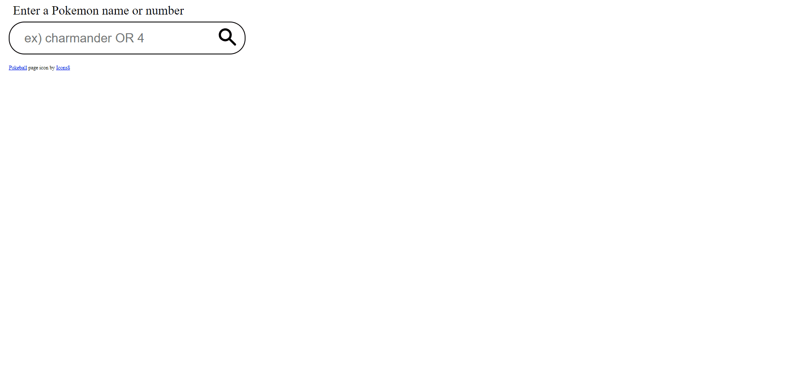

# Pokémon Search

Pokémon Search is a web application that allows users to search for their favorite Pokémon via their Pokédex numbers or English names. Complete with game-accurate color-coded typing!

View the hosted site here: [Daily Happiness](https://simple-pokemon-search.netlify.app/)

## Usage

- Type in the Pokédex number or English name of the desired Pokémon
- Hit enter or click the magnifying glass icon to see the results
- Results include an image, Pokédex number, English name, and typing(s)

## Contributing

Pull requests are welcome. For major changes, please open an issue first
to discuss what you would like to change.
